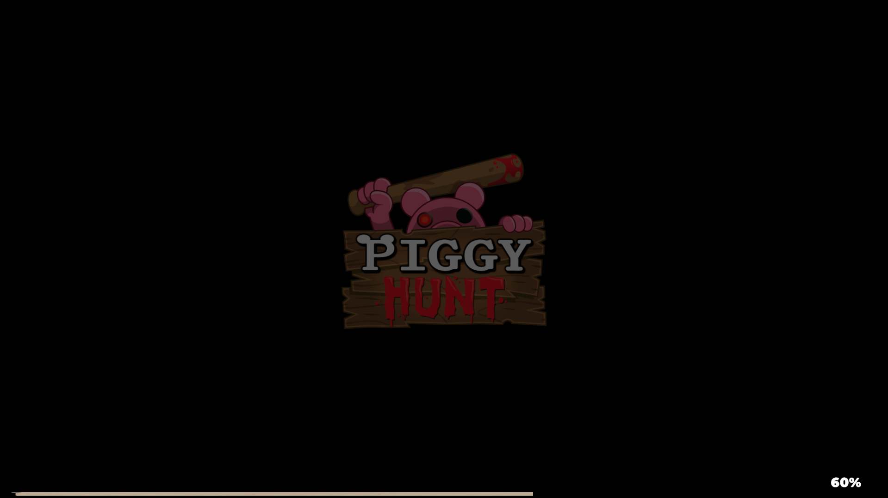

# Orion Hunt
The first private server source for the abandoned steam game 'PIGGY: Hunt'

### WARNING: At the moment, the client will only reach 60% but I will soon fix the problem in the future. 

---

## Requirements     

Make sure you have the following installed:

- UwAmp Wamp Server [(download here)](https://www.uwamp.com/file/UwAmp.exe)
- Fiddler Classic [(download here)](https://www.telerik.com/fiddler/fiddler-classic)
- Piggy Hunt Client [(download here)](https://mega.nz/folder/1qt02byb#ZxDqEQh3sZLvNCPRpeY4yw)

---

## UwAmp Setup

1. Download and install UwAmp
2. Launch UwAmp
3. Start Apache
4. Open: C:\UwAmp\www
5. Place the repository files inside the www folder
6. Make sure Apache is running on port 80 or 443

---

## Fiddler Setup

- Go to Tools > Options > HTTPS and enable "Capture HTTPS CONNECTs", "Decrypt HTTPS traffic" and then click Actions then click "Trust Root Certificate".
- Go to AutoResponder and then enable "Enable rules" then add a new rule in the "Rule Editor".
- In the rule editor, for "If request matches..." add ```REGEX:^https?://api\.beamable\.com/(.*)$``` and "then respond with..." add ```http://localhost/$1```

---

## Connecting     

1. Download the client
2. Launch the client
3. The client should now connect through your local server

---

## Screenshots



---

## Disclaimer
**Orion Hunt** uses resources from **Beamable**’s API and is not affiliated with **MiniToon** or **Shaggy Doge**.
All rights to Piggy, Piggy: Intercity, and PIGGY: Hunt belong to their respective owners.

If a takedown is requested by the original developers, this repository will be removed.
